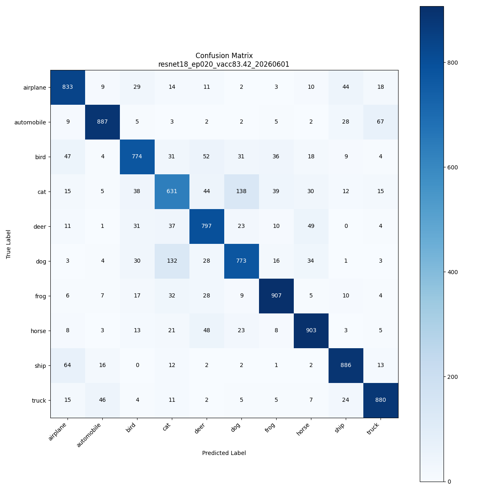
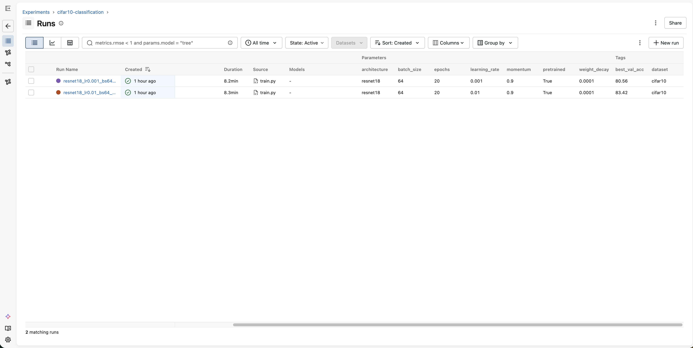
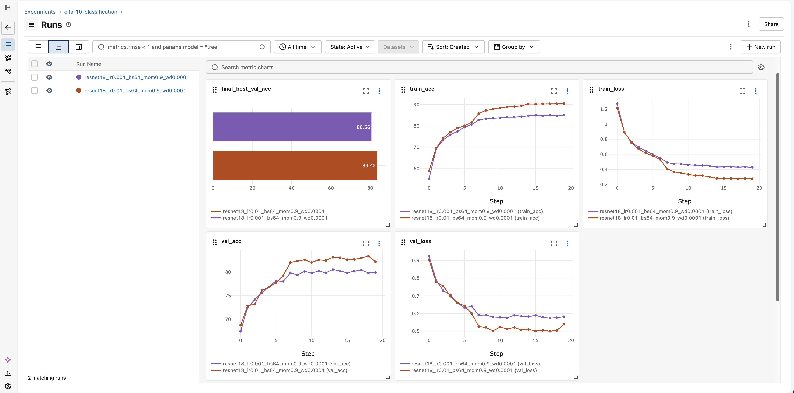
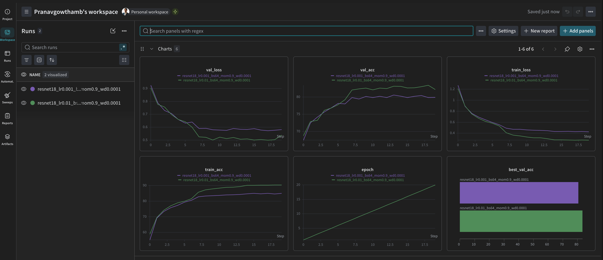

# mlops-gcp-pipeline

A production-grade MLOps pipeline built on Google Cloud Platform, demonstrating the full ML lifecycle from model training to deployment and monitoring. Built using CIFAR-10 image classification as the ML problem, with ResNet-18 trained in PyTorch.

---

## Architecture Overview

```
GitHub Repository
      ↓ push
GitHub Actions (CI/CD)
      ↓ build + test + push
GCP Artifact Registry
      ↓ deploy
GKE Inference API (FastAPI + ResNet-18)
      ↓ predictions logged
BigQuery Prediction Logs + GCS Image Storage
      ↓ daily drift detection (Phase 6/7 — in progress)
Cloud Composer Airflow
      ↓ drift detected
Automated Retraining Pipeline
      ↓ new model
GKE Inference API (updated)
```

---

## Tech Stack

| Component | Technology |
|---|---|
| ML Framework | PyTorch |
| Model | ResNet-18 (pretrained, fine-tuned) |
| Experiment Tracking | MLflow + Weights & Biases |
| Containerisation | Docker |
| Container Registry | GCP Artifact Registry |
| CI/CD | GitHub Actions |
| Model Serving | FastAPI |
| Deployment | Google Kubernetes Engine (GKE) |
| Prediction Logging | BigQuery + GCS |
| Orchestration | Cloud Composer (Airflow) — in progress |
| Cloud Platform | Google Cloud Platform |

---

## Project Structure

```
mlops-gcp-pipeline/
├── src/
│   ├── model.py              # ResNet-18 architecture
│   ├── train.py              # Training script with grid search
│   ├── evaluate.py           # Evaluation with confusion matrix
│   └── dataset.py            # CIFAR-10 data loading
├── api/
│   ├── main.py               # FastAPI inference server
│   ├── models.py             # Request/response schemas
│   └── utils.py              # Image preprocessing
├── docker/
│   ├── Dockerfile.train      # Training container (CUDA)
│   └── Dockerfile.api        # Inference container (CPU)
├── k8s/
│   ├── deployment.yaml       # Kubernetes deployment
│   └── service.yaml          # LoadBalancer service
├── dags/
│   ├── training_pipeline.py  # Airflow training DAG
│   ├── evaluation_pipeline.py
│   ├── retraining_trigger.py
│   └── monitoring_dag.py     # Drift detection DAG
├── tests/
│   ├── test_model.py         # Model unit tests
│   └── test_api.py           # API unit tests
├── configs/
│   └── train_config.yaml     # Hyperparameters and paths
└── .github/
    └── workflows/
        └── ci.yml            # CI/CD pipeline
```

---

## Phase 1 — Model Training

- ResNet-18 fine-tuned on CIFAR-10 (10 classes, 60,000 images)
- Transfer learning from ImageNet weights
- Grid search across learning rates: `[0.01, 0.001]`
- SGD optimiser with momentum=0.9, weight_decay=0.0001
- StepLR scheduler (step_size=7, gamma=0.1)
- Training on GCP VM with NVIDIA T4 GPU

### Results

| Run | Architecture | LR | Epochs | Best Val Acc |
|---|---|---|---|---|
| 1 | ResNet-18 | 0.01 | 20 | **83.42%** |
| 2 | ResNet-18 | 0.001 | 20 | 80.56% |

### Classification Report — Best Model

```
Checkpoint: resnet18_ep020_vacc83.42_20260601
Val Loss: 0.5127 | Val Accuracy: 82.71%

              precision    recall  f1-score   support
    airplane       0.82      0.86      0.84       973
  automobile       0.90      0.88      0.89      1010
        bird       0.82      0.77      0.80      1006
         cat       0.68      0.65      0.67       967
        deer       0.79      0.83      0.81       963
         dog       0.77      0.75      0.76      1024
        frog       0.88      0.88      0.88      1025
       horse       0.85      0.87      0.86      1035
        ship       0.87      0.89      0.88       998
       truck       0.87      0.88      0.87       999
    accuracy                           0.83     10000
   macro avg       0.83      0.83      0.83     10000
weighted avg       0.83      0.83      0.83     10000
```

### Confusion Matrix



---

## Phase 2 — Experiment Tracking

Two experiment tracking tools used simultaneously to demonstrate familiarity with both.

### MLflow
- Self-hosted on GCP VM
- Logs parameters, metrics, and artifacts per run
- Model registry for checkpoint versioning
- Tags: `best_val_acc`, `dataset`, `checkpoint`, `date`

### Weights & Biases
- Cloud-hosted SaaS
- Real-time training curves during active training
- Hyperparameter comparison across runs
- GPU utilisation monitoring

### MLflow vs W&B

| | MLflow | W&B |
|---|---|---|
| Hosting | Self-hosted | Cloud SaaS |
| Real-time charts | No | Yes |
| Model Registry | Yes | Yes |
| Cost at scale | Free | Paid |
| Best for | Production pipelines | Active experimentation |

### Experiment Overview (MLflow)



### Run Comparison (MLflow)



### Training Curves (W&B)



---

## Phase 3 — Containerisation

Two Docker images built and pushed to GCP Artifact Registry:

**Training image** (cifar10-train) — CUDA-enabled PyTorch base image, packages src/ and configs/. Used for GPU-accelerated training.

**Inference image** (cifar10-api) — CPU-only PyTorch, packages api/ and src/. Minimal dependencies for fast startup and low cost.

Both images tagged with latest and the Git commit SHA for full traceability and rollback capability.

---

## Phase 4 — CI/CD with GitHub Actions

On every push to `main` (for relevant file changes):

1. **Run Tests** — pytest runs all unit tests for model and API
2. **Build Docker Images** — both training and inference images built
3. **Push to Artifact Registry** — images tagged with `latest` and commit SHA
4. **Deploy to GKE** — inference API updated if cluster is running
5. **Deploy DAGs** — Airflow DAGs synced to Cloud Composer bucket

Path filtering ensures CI only triggers when relevant files change:
`src/`, `api/`, `docker/`, `tests/`, `configs/`, `dags/`, `k8s/`, `monitoring/`

---

## Phase 5 — Kubernetes Deployment

Inference API deployed to GKE:

- **Deployment:** 1 replica, `e2-standard-2` node
- **Service:** LoadBalancer with public IP
- **Health checks:** Liveness and readiness probes on `/health`
- **Model loading:** Checkpoint downloaded from GCS at startup
- **Prediction logging:** Every prediction logged to BigQuery + image saved to GCS

### API Endpoints

| Endpoint | Method | Description |
|---|---|---|
| `/health` | GET | Health check |
| `/predict` | POST | Upload image, get prediction |
| `/classes` | GET | List all 10 classes |
| `/docs` | GET | Interactive Swagger UI |

### Prediction Logging Schema (BigQuery)

| Column | Type | Description |
|---|---|---|
| `timestamp` | TIMESTAMP | When prediction was made |
| `predicted_class` | STRING | Predicted CIFAR-10 class |
| `confidence` | FLOAT | Model confidence (%) |
| `image_filename` | STRING | UUID filename |
| `image_gcs_path` | STRING | GCS path to uploaded image |
| `model_version` | STRING | Model version identifier |

---

## How to Run

### Prerequisites

- GCP project with billing enabled
- `gcloud` CLI authenticated
- Docker installed
- Python 3.10+

### 1. Clone the repository

```bash
git clone https://github.com/pg-gitcommits/mlops-gcp-pipeline.git
cd mlops-gcp-pipeline
```

### 2. Set up environment

```bash
python3 -m venv venv
source venv/bin/activate
pip install torch torchvision --index-url https://download.pytorch.org/whl/cpu
pip install -r requirements.txt
```

### 3. Configure

```bash
# Set your GCP project ID
export GCP_PROJECT_ID=your-project-id
export GCS_BUCKET=your-gcs-bucket
```

Update `configs/train_config.yaml` with your GCP project ID.

### 4. Train

```bash
python3 -m src.train --config configs/train_config.yaml
```

### 5. Evaluate

```bash
python3 -m src.evaluate --config configs/train_config.yaml
```

### 6. Run tests

```bash
python3 -m pytest tests/ -v
```

### 7. Build and run inference API locally

```bash
docker build -f docker/Dockerfile.api -t cifar10-api:latest .
docker run -p 8000:8000 \
  -e MODEL_CHECKPOINT=checkpoints/your_checkpoint.pt \
  -v $(pwd)/checkpoints:/app/checkpoints \
  cifar10-api:latest
```

Open `http://localhost:8000/docs` to test predictions.

### 8. Deploy to GKE

```bash
# Create cluster
gcloud container clusters create cifar10-cluster \
  --zone=europe-west4-a \
  --num-nodes=1 \
  --machine-type=e2-standard-2 \
  --scopes=cloud-platform

# Deploy
kubectl apply -f k8s/deployment.yaml
kubectl apply -f k8s/service.yaml

# Get public IP
kubectl get service cifar10-api-service
```

---

## GitHub Actions Secrets Required

| Secret | Description |
|---|---|
| `GCP_SA_KEY` | GCP service account JSON key |
| `GCP_PROJECT_ID` | GCP project ID |
| `GCP_REGION` | GCP region (e.g. `europe-west4`) |
| `COMPOSER_BUCKET` | Cloud Composer GCS bucket name |

---

## Future Work

### Phase 6 — Airflow Orchestration (in progress)
Airflow DAGs are written and deployed to Cloud Composer:
- `training_pipeline` — orchestrates full training run via GKE
- `evaluation_pipeline` — runs evaluation and uploads reports
- `retraining_trigger` — triggers training + evaluation sequentially
- `monitoring_dag` — daily drift detection, triggers retraining automatically

Remaining: resolve MLflow connectivity from Airflow training pods (see Option B in code comments — deploy MLflow on Cloud Run).

### Phase 7 — Monitoring and Drift Detection
- Prediction logs already being collected in BigQuery (Phase 5)
- Drift detection logic written in `monitoring_dag.py` using chi-squared test and Jensen-Shannon divergence
- Remaining: standalone `monitoring/drift_detector.py`, end-to-end loop testing

---

## License

MIT
ENDOFFILE
